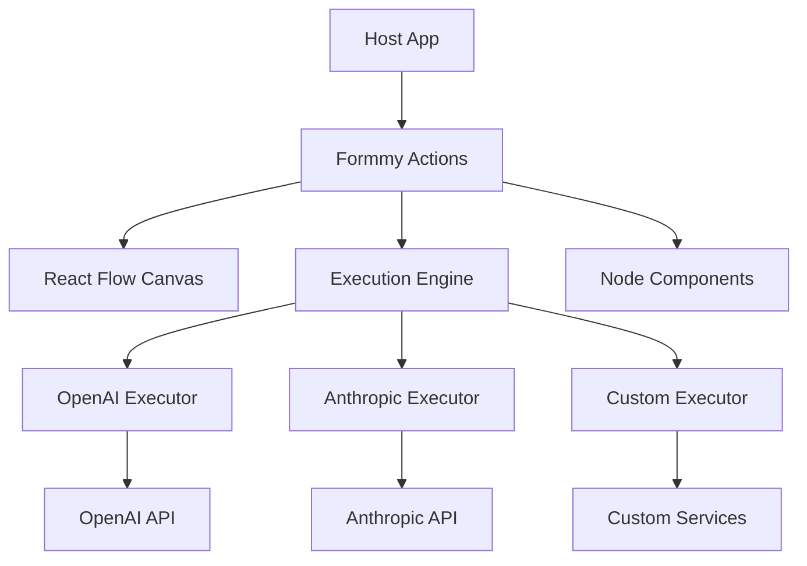

# 🚀 Formmy Actions - Agentic flows made simple

**Embeddable React Flow component for building visual AI agent workflows**

[](https://reactjs.org/)
[](https://www.typescriptlang.org/)
[](https://reactflow.dev/)
[](https://tailwindcss.com/)

## 🎯 What is Formmy Actions?

**Formmy Actions** is an **embeddable React component** that provides visual workflow creation capabilities for AI agent orchestration. Originally developed as a core feature for [formmy.app](https://formmy.app), it's designed to be **integrated into any React application** as a standalone library.

### 🏗️ Built as a Distributed Feature

This isn't just another workflow tool - it's a **microservice-ready component library** designed to:

- ✅ **Embed seamlessly** into existing React applications
- ✅ **Communicate via API calls** for distributed architectures  
- ✅ **Scale independently** as a separate service
- ✅ **Integrate with formmy.app** and other platforms

## 🌟 Key Features

### 🎨 Visual Workflow Builder
- **Drag & drop interface** powered by React Flow
- **Real-time visual connections** between AI agents
- **Dynamic node types** with smart color coding by provider
- **Persistent state management** with auto-save functionality

### 🤖 Multi-Provider AI Support
- **OpenAI Integration** (GPT-3.5, GPT-4, GPT-4o series)
- **Anthropic Support** (Claude 3 Haiku, Sonnet, Opus, 3.5 Sonnet)
- **Dynamic model loading** from provider APIs
- **Provider-specific theming** (Green for OpenAI, Amber for Anthropic)

### ⚡ Developer Experience
- **TypeScript-first** with full type safety
- **Hot reload** with instant feedback
- **Component isolation** for easy embedding
- **Comprehensive save system** with Cmd/Ctrl+S shortcuts

### 🔧 Advanced Functionality
- **Execution Engine** with support for distributed processing
- **Global configuration management** for API keys and settings
- **Toast notifications** for user feedback
- **Keyboard shortcuts** for power users
- **Responsive design** with fixed sidebars

## 🚀 Quick Start

### Installation

```bash
npm create vite@latest my-ai-workflows -- --template react-ts
cd my-ai-workflows
npm install

# Install dependencies
npm install @xyflow/react react-hot-toast @tailwindcss/forms
```

### Basic Usage

```tsx
import { AIFlowCanvas } from 'formmy-actions';

function App() {
  return (
    <div className="w-full h-screen">
      <AIFlowCanvas 
        apiKeys={{
          openai: 'your-openai-key',
          anthropic: 'your-anthropic-key'
        }}
        onSave={(flowData) => {
          // Handle flow persistence
          console.log('Saving flow:', flowData);
        }}
        onExecute={(flowData) => {
          // Handle flow execution
          console.log('Executing flow:', flowData);
        }}
      />
    </div>
  );
}
```

## 🏠 Origin Story - Born at formmy.app

**Formmy Actions** was originally developed as a core feature for [formmy.app](https://formmy.app), a platform for creating intelligent forms and workflows. As the AI workflow capabilities grew in complexity and utility, we realized this could be a **standalone feature that benefits the entire React ecosystem**.

### Why Extract from formmy.app?

1. **🔄 Reusability**: Other applications need visual AI workflow capabilities
2. **🏗️ Modularity**: Better architecture through component separation  
3. **🌐 Community**: Open source approach benefits everyone
4. **📈 Scalability**: Independent scaling and deployment options

### Connection to formmy.app

While **Formmy Actions** can be used standalone, it's designed to integrate seamlessly back into formmy.app and similar platforms:

```tsx
// In formmy.app
import { FormBuilder } from '@formmy/core';
import { AIFlowCanvas } from 'formmy-actions';

function FormWithAI() {
  return (
    <div className="flex">
      <FormBuilder />
      <AIFlowCanvas 
        formContext={true}
        onFormAction={(action) => {
          // Handle AI actions on form data
        }}
      />
    </div>
  );
}
```

## 🎨 Component Architecture

### Distributed Design



### Self-Contained Components
- **InputNode**: Text input with auto-expansion
- **AgentNode**: AI model configuration with provider theming
- **OutputNode**: Results display with formatting
- **PromptNode**: Template management with variables
- **FunctionNode**: Custom logic execution
- **ToolNode**: External tool integration

## 📖 Documentation

### Core Concepts

1. **Nodes**: Individual components in the workflow
2. **Edges**: Connections defining data flow
3. **Executors**: Runtime engines for different AI providers
4. **Global Config**: Shared settings across all workflows

### API Reference

```tsx
interface AIFlowCanvasProps {
  apiKeys?: {
    openai?: string;
    anthropic?: string;
  };
  initialFlow?: FlowData;
  onSave?: (flowData: FlowData) => void;
  onExecute?: (flowData: FlowData) => Promise<any>;
  theme?: 'light' | 'dark' | 'auto';
  readonly?: boolean;
}
```

### Embedding Examples

#### Minimal Embedding
```tsx
import { AIFlowCanvas } from 'formmy-actions';

<AIFlowCanvas />
```

#### Full Configuration
```tsx
<AIFlowCanvas 
  apiKeys={{
    openai: process.env.OPENAI_API_KEY,
    anthropic: process.env.ANTHROPIC_API_KEY
  }}
  theme="dark"
  onSave={async (flow) => {
    await saveToDatabase(flow);
  }}
  onExecute={async (flow) => {
    return await executeWorkflow(flow);
  }}
  readonly={false}
/>
```

## 🛠️ Development

### Local Development

```bash
# Clone the repository
git clone https://github.com/blissito/formmy_actions.git
cd formmy_actions

# Install dependencies
npm install

# Start development server
npm run dev

# Open http://localhost:5173
```

### Building for Production

```bash
# Build the library
npm run build

# Build for embedding
npm run build:embed
```

## 🤝 Contributing

We welcome contributions! This project originated from formmy.app but is now a community effort.

### Development Guidelines

1. **Component Isolation**: Each component should work independently
2. **API-First**: Design for distributed architectures
3. **TypeScript**: Maintain full type safety
4. **Testing**: Include tests for new features
5. **Documentation**: Update README for new capabilities

### Submit Issues

Found a bug or have a feature request? [Open an issue](https://github.com/blissito/formmy_actions/issues)

## 📄 License

MIT License - see [LICENSE](LICENSE) for details

## 🔗 Related Projects

- [formmy.app](https://formmy.app) - The original platform where this was born
- [React Flow](https://reactflow.dev/) - The underlying flow library
- [@ai-sdk](https://sdk.vercel.ai/) - AI SDK integration

## 🙏 Acknowledgments

- **formmy.app team** - For the original vision and development
- **React Flow team** - For the amazing foundation
- **Vercel AI SDK** - For AI integration capabilities
- **Community contributors** - For making this better

---

**Made with ❤️ by the formmy.app team and community contributors**

*Originally developed for formmy.app, now available as a standalone embeddable component for the React ecosystem.*